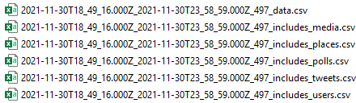

# tweet_download

This program downloads tweets from Twitter APIs(v2) using Academic development accounts. All returned information are stored. Note the APIs are still evolving, so the code here may not work in the future. 

There are four folders to store downloaded tweets: 


- `raw_tweets`: raw data from Twitter, including five parts of each request: `data`, `media`, `places`, `users`, and `polls`. Each part is stored as a individual .CSV file. Strings in these .CSV files are cleaned by removing newlines, tabs, and commas (`,` is replaced by `;`). Please refer to [Twitter API Documentation](https://developer.twitter.com/en/docs/twitter-api/fields).  

  `file name`: `oldest posted time`_`lastest posted time`_`tweets_count`_`part`. For example:   

   
- `line_tweets`: Five parts are merged together, each row in this file contains all columns returned by the API. The result of each request is a single file. There are 100 lines (with `context_annotation`) or 500 lines (without `context_annotation`) per file. `context_annotation` is like a topic assigned to a tweet. 

    About [`context_annotation`](https://developer.twitter.com/en/docs/twitter-api/annotations/overview): 
    
    >**Context annotations**: Derived from the analysis of a Tweet’s text and will include a domain and entity pairing which can be used to discover Tweets on topics that may have been previously difficult to surface. At present, we’re using a list of 50+ domains to categorize Tweets.

- `chunks_tweets`: Merged `line_tweets` for better managements of Hadoop systems. Each merged .CSV files have about 50,000 - 500,000 tweets. 

- `cluster_csvs`: Converted `chunks_tweets`. Some fields are expanded for our Hadoop systems.

 
 # How to use
* Prerequisite:
   - [Develop account](https://developer.twitter.com/en/products/twitter-api/academic-research). Put your keys in `tweet_api_keys.txt` (put this file in the same folder as the `download_tweet_APIv2.py`).
    ```
    Consumer API Key: copy_your_key_here
    Consumer API Secret Key: copy_your_key_here
    Bearer Token: copy_your_key_here
    Access Token: copy_your_key_here
    Access Token Secret: copy_your_key_here
    ```
   - Packages: tqdm, requests, pandas, vaderSentiment, emoji

* Using `download_tweet_APIv2.py` to download tweets.
 
     Edit the parameters in the fucntion of `execute_download`, such as `saved_path`, `query`, `start_time`, `end_time`, and `chunk_size`. 
 
     To build a query, you need to read [Building a query](https://developer.twitter.com/en/docs/twitter-api/tweets/search/integrate/build-a-query) or [How to write search queries](https://github.com/twitterdev/getting-started-with-the-twitter-api-v2-for-academic-research/blob/main/modules/5-how-to-write-search-queries.md). Here is a example: 
 `vaccin OR vaccination OR vaccine OR vaccinate place_country:AU`. It means to collect tweets posted in Australia contain words `vaccin`, `vaccination`, or `vaccinate`.
 
 `has:geo`, ` from:cnn OR from:FoxNews`. Note "OR" is capitalized.
 
* Please pay attention to the tweet count returned at the begining. If it is not your expectation, just stop the program then refine the query.
 
  
 # Rate limit
   According to [official documentation](https://developer.twitter.com/en/docs/twitter-api/rate-limits), 300 requests are allowed per 15 minutes; 500 tweets per requets (or 100 tweet with `context_annotation`). So the highest speed is 600,000 tweets per hour. However, due to heavy converting computations, the current speed is about 100 request per 15 minutes, which is 200,000 tweets per hour.
   
   Upated: after adding sub-processes to merge responses and to convert the tweet chunks, the downloading speed now is about 500,000 tweet/hour. 
 
 # Other solutions 
 
   If you do not like this repository, [twarc](https://github.com/DocNow/twarc) is highly recommanded. The purpose my repository is to collect all data from API, which twarc does not, at least its plug-in [twarc-csv](https://github.com/DocNow/twarc-csv).    
  
 # To do
 
 - Adaptive sleeping when breaking the rate limits.
 - Code refining.
 - Result merging and compressing.
 

